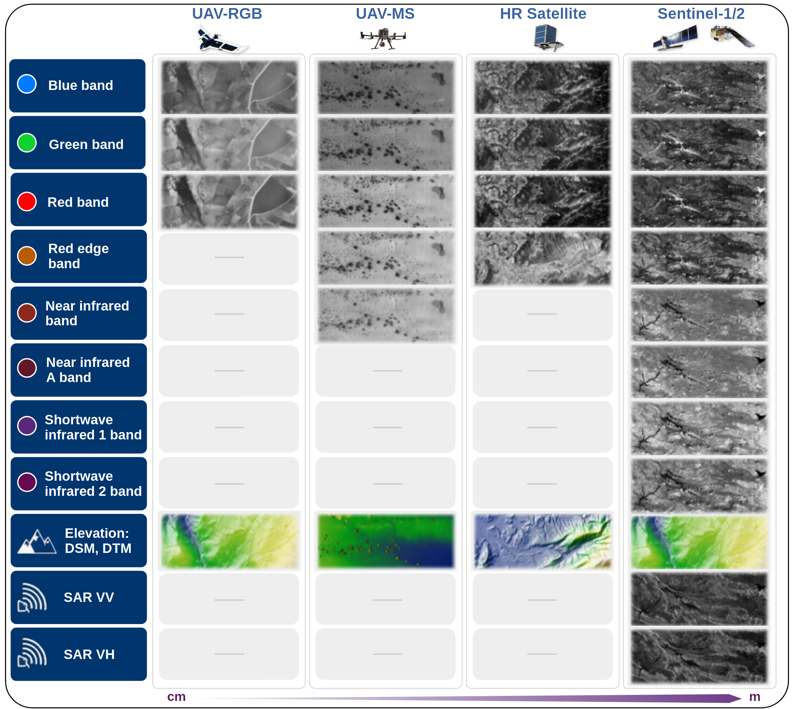
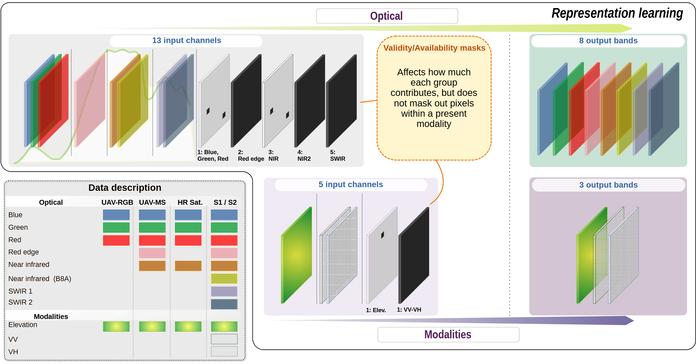

## **FLORO: A Multimodal Geospatial Foundation Model for Ecological Remote Sensing Across Sensors and Scales**

<p style="text-align: center;">
Jorge L. Rodríguez, Victor Angulo-Morales, Areej Alwahas, Mariana Elías-Lara, Fida Mohammad Thoker, Kasper Johansen, Bernard Ghanem, Fernando T. Maestre, and Matthew F. McCabe
</p>

<p style="text-align: center;"><i>
Biological and Environmental Science and Engineering Division, King Abdullah University of Science and Technology, Thuwal, Saudi Arabia</i>
</p>

<p style="text-align: center;"><i>
Computer, Electrical and Mathematical Science and Engineering Division, King Abdullah University of Science and Technology, Thuwal, Saudi Arabia</i>
</p>


---

## **Overview**

**FLORO:** is a multimodal geospatial foundation model designed to learn transferable representations from a compact but highly diverse remote sensing corpus.

FLORO is pretrained using masked autoencoding on heterogeneous Earth observation data, including multispectral satellite imagery, synthetic-aperture radar, high-resolution commercial imagery, UAV products, and terrain information. Rather than relying only on very large pretraining corpora, FLORO explores whether diversity across sensors, spatial resolutions, spectral configurations, and ecological settings can produce representations that transfer effectively across remote sensing tasks.

> Under the frozen-encoder evaluation protocol of the PANGAEA benchmark, FLORO demonstrates strong transfer performance across semantic segmentation, scene classification, and regression tasks. Its results suggest that competitive geospatial representations can emerge from carefully curated multimodal pretraining data, even when the number of pretraining samples is much smaller than in several recent large-scale remote sensing foundation models.

---

## 🧠 **Architecture**

> FLORO uses a Vision Transformer encoder pretrained through masked autoencoding. During pretraining, heterogeneous remote sensing observations are tokenized and partially masked. The encoder learns latent representations from the visible tokens, while lightweight reconstruction decoders predict the masked content for each modality.

> After pretraining, the shallow reconstruction decoders are discarded. The pretrained encoder is then evaluated under frozen-encoder transfer, where task-specific benchmark decoders are trained for downstream tasks such as semantic segmentation, scene classification, and regression.


---

## 🌍 **Pretraining Data**

> FLORO is pretrained on a heterogeneous collection of remote sensing observations designed to expose the model to variation in spatial resolution, spectral coverage, sensing geometry, and ecological context. 

The pretraining corpus includes:

- **Sentinel-2 multispectral imagery**, providing medium-resolution optical observations across visible, red-edge, near-infrared, and shortwave-infrared bands.
- **Sentinel-1 SAR imagery**, providing radar backscatter information that complements optical observations, particularly under cloud cover or degraded optical conditions.
- **SkySat high-resolution imagery**, introducing fine spatial detail and commercial satellite observation characteristics.
- **Terrain and elevation products**, including global and local digital elevation or terrain-derived data.
- **UAV RGB and multispectral products**, including very high-resolution orthomosaics, digital surface models, and vegetation-structure information.



> The objective is not only to increase the number of pretraining samples, but to increase the diversity of sensing conditions encountered during representation learning.

---

## 🔨 **Pretraining regime**

FLORO is pretrained on approximately 80K remote sensing image samples spanning satellite, airborne, UAV, optical, SAR, and terrain-derived data sources. The model supports multispectral optical data, Sentinel-1 SAR backscatter, elevation products, UAV-derived structural information, and high-resolution imagery. FLORO learns by reconstructing masked content from partially observed multimodal inputs, encouraging the encoder to capture both spectral and spatial structure. Availability and validity channels allow the model to distinguish between observed, missing, and invalid data, supporting transfer across datasets with different sensor configurations.



---

## Input Representation

FLORO uses grouped input channels to represent different optical and auxiliary modalities.

### Optical input

The optical stream contains spectral reflectance information and corresponding validity indicators. It can represent visible, red-edge, near-infrared, and shortwave-infrared information depending on sensor availability.

Typical optical groups include:

| Group | Description |
|---|---|
| Blue, Green, Red | Visible optical bands |
| Red edge | Vegetation-sensitive red-edge band |
| Near infrared | NIR vegetation-sensitive band |
| Near infrared A | Additional NIR-like band when available |
| SWIR 1, SWIR 2 | Shortwave-infrared bands |
| Validity channels | Indicators for available or valid spectral groups |

### Auxiliary modalities

The auxiliary stream represents terrain and radar information.

| Group | Description |
|---|---|
| Elevation | DSM, DTM, DEM, or related terrain-derived information |
| SAR VV | Sentinel-1 vertical transmit / vertical receive backscatter |
| SAR VH | Sentinel-1 vertical transmit / horizontal receive backscatter |
| Validity channels | Indicators for available or valid auxiliary modalities |

---

## Installation

Create the FLORO conda environment:

```bash
conda env create -f environment.yml
conda activate floro-geo
pip install -e .
```
---

## Downstream Evaluation

FLORO is evaluated under a frozen-encoder transfer protocol. The pretrained encoder is kept fixed, while task-specific decoders are trained for downstream prediction.

The evaluated task families include:

- **Semantic segmentation**, including land-cover, flooding, burn scars, crop type, and urban mapping tasks.
- **Scene classification**, including multispectral land-cover classification.
- **Regression**, including biomass and canopy-height estimation.

This evaluation setup tests whether the pretrained representation transfers across sensors, scales, geographic regions, and ecological applications.


## PANGAEA Benchmark Reproducibility

> The `pangaea-bench/` directory contains the files used to reproduce the FLORO evaluation under the PANGAEA benchmark protocol. This directory intentionally mirrors the folder structure of the official PANGAEA repository, so that users can copy the provided files into the corresponding locations of a local PANGAEA installation.

This directory intentionally mirrors the folder structure used by the official `pangaea-bench` repository. Our goal is to make the integration reproducible while the FLORO encoder wrapper and configuration files are not yet included in the upstream PANGAEA repository.

## Repository Structure

```text
.
├── assets/
│   ├── gifs/                 # Animations used in the README and project page
│   └── images/               # Architecture and pretraining figures
│
├── pangaea-bench/            # Drop-in files for PANGAEA benchmark reproducibility
│   ├── configs/
│   │   ├── dataset/           # Dataset configuration files used in the benchmark
│   │   └── encoder/           # FLORO encoder configuration files
│   └── pangaea/
│       ├── datasets/          # Dataset wrappers required for the reported evaluation
│       └── encoders/          # FLORO encoder wrapper for PANGAEA
│
├── scripts/
│   └── pre_training_geo.py    # FLORO pretraining entry point
│
└── src/floro/
    ├── config/                # Configuration parsers
    ├── data/                  # FLORO pretraining and dataloader utilities
    ├── models/                # Encoder, MAE decoder, linear decoder, and model blocks
    └── utils/                 # Training, checkpointing, distributed, and fine-tuning utilities
```

### Using the PANGAEA integration files

To reproduce the benchmark setup, copy the files from this repository into the corresponding folders of your local PANGAEA clone:

```text
FLORO/pangaea-bench/configs/encoder/floro.yaml
→ PANGAEA/configs/encoder/floro.yaml

FLORO/pangaea-bench/configs/encoder/floro_dem.yaml
→ PANGAEA/configs/encoder/floro_dem.yaml

FLORO/pangaea-bench/configs/encoder/floro_optical.yaml
→ PANGAEA/configs/encoder/floro_optical.yaml

FLORO/pangaea-bench/configs/dataset/biomassters.yaml
→ PANGAEA/configs/dataset/biomassters.yaml

FLORO/pangaea-bench/configs/dataset/espeletia_chm.yaml
→ PANGAEA/configs/dataset/espeletia_chm.yaml

FLORO/pangaea-bench/configs/dataset/potsdam_ir_dem.yaml
→ PANGAEA/configs/dataset/potsdam_ir_dem.yaml

FLORO/pangaea-bench/pangaea/encoders/floro_encoder.py
→ PANGAEA/pangaea/encoders/floro_encoder.py

FLORO/pangaea-bench/pangaea/datasets/biomassters.py
→ PANGAEA/pangaea/datasets/biomassters.py

FLORO/pangaea-bench/pangaea/datasets/espeletia_chm.py
→ PANGAEA/pangaea/datasets/espeletia_chm.py

FLORO/pangaea-bench/pangaea/datasets/potsdam_ir_dem.py
→ PANGAEA/pangaea/datasets/potsdam_ir_dem.py
```