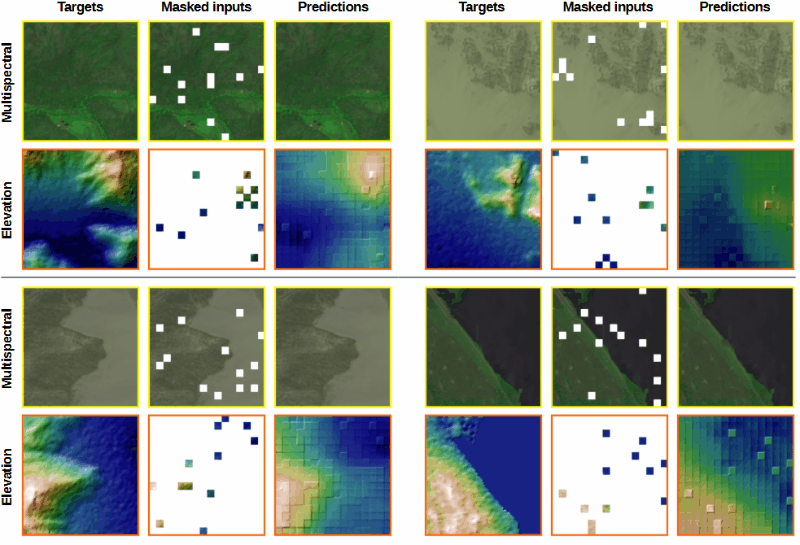
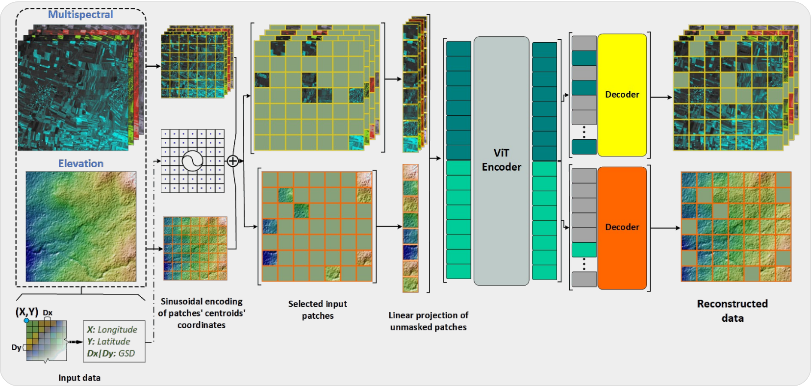

Jorge L. Rodríguez, Kasper Johansen, Areej Alwahas, Mariana Elías-Lara, Victor Angulo-Morales, Fernando T. Maestre and Matthew F. McCabe

<i>
Climate and Livability Initiative, Biological and Environmental Science and Engineering Division, King Abdullah University of Science and Technology, Thuwal, Saudi Arabia</i>

Reconstruction examples generated by the shallow decoder during FLORO pretraining.

---

## **Overview**

**FLORO (Foundation Learning Of Remote Sensing Observations for Ecological Research)** is a multimodal, multitask Vision Transformer-based foundation model designed for scalable ecological monitoring using both multispectral satellite data and elevation sources.

Built with a masked autoencoder backbone and fine-tuned on diverse ecological tasks, FLORO generalizes well across modalities, sensor types, and ecosystems.

---

## 🔍 **Highlights**

- **Multimodal Inputs**: Uses multispectral bands + digital surface models (DSM) from SRTM, UAV, or photogrammetric data.
- **Self-Supervised Pretraining**: Trained with adaptive masked autoencoding strategies across 400K+ image patches.
- **Flexible Decoders**: Task-specific decoders output vegetation structure (CHM), forage biomass, and nutrient content.

---

## 🧠 **Architecture**

> A full Transformer-based encoder is pretrained via masked image autoencoding. Downstream decoders are optimized using supervised objectives for both segmentation and regression tasks.

